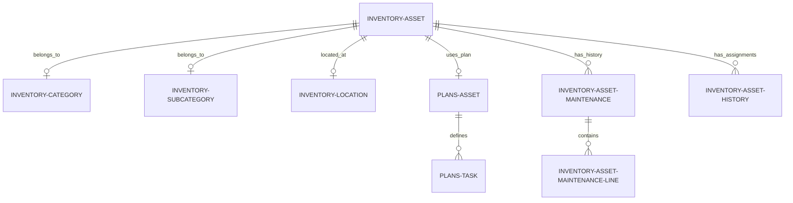
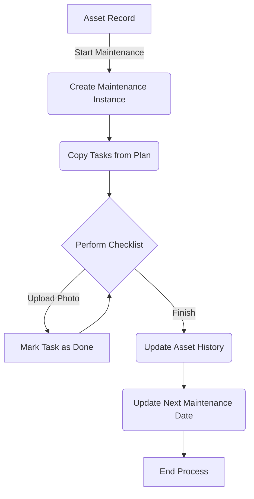

# Asset Inventory Module - Technical Documentation (EN)

Welcome to the documentation for the Wavext Asset Inventory module. This guide is structured according to the Diátaxis framework to help you learn, use, and understand the system effectively.

---

## 1. Tutorial: Getting Started

This tutorial will guide you through setting up the module and creating your first asset record.

### Prerequisites
- **Odoo 18** environment (Docker-based recommended).
- Python library `qrcode` installed in your Odoo environment.
- Access to an Odoo database with the `hr` and `hr_skills` modules installed.

### Step 1: Module Installation
1. Place the `Inventario` folder in your Odoo `addons` directory.
2. Update the app list in Odoo (Enable Developer Mode -> Apps -> Update App List).
3. Search for "Modulo de inventario de Wavext" and click **Activate**.

### Step 2: Initial Configuration
Before creating assets, you must define the classification structure:
1. Navigate to **Asset Management > Configuration > Categories**. Create a category (e.g., "Hardware", Code: "HW").
2. Go to **Subcategories**. Create a subcategory linked to "Hardware" (e.g., "Laptop", Code: "LP").
3. Go to **Locations**. Create a location (e.g., "Main Office", Code: "OFF").

### Step 3: Creating Your First Asset
1. Go to **Asset Management > Operations > Inventory**.
2. Click **New**.
3. Fill in the **Name** (e.g., "Developer Laptop 01").
4. Select the **Category**, **Subcategory**, and **Location** created in Step 2.
5. Save the record. You will see an **Standardized ID** (e.g., `HW.LP.OFF.0001.2026`) and a **QR Code** automatically generated.

---

## 2. How-to Guides

Practical recipes for common developer and administrator tasks.

### How to Assign an Asset to an Employee
1. Open the Asset form.
2. In the **Responsible and Owner** section, ensure "Type of Responsible" is set to "Employee".
3. Select the employee in the **Responsible (Employee)** field.
4. Save. The system will automatically record this in the **Assignment History** tab and the employee's profile will now show this asset.

### How to Start a Maintenance Process
1. Ensure the asset has a **Maintenance Plan** assigned in the "Technical Details" tab.
2. Click the **Start Maintenance** button in the header.
3. The status will change to "In Progress", and a "Maintenance ACTIVE" tab will appear.
4. Complete the tasks in the checklist, marking them as done and optionally uploading evidence photos.
5. Click **Finish Maintenance** to move the record to history and update the next maintenance date.

### How to Print Asset Labels
1. Open any Asset record.
2. Click the **Print ID** button in the header.
3. A PDF report will be generated containing the Asset Name, ID, and the QR code for physical labeling.

### How to Extend the Standardized ID Logic

The Standardized ID (`identificador_final`) is a computed field stored in the database. It currently follows the pattern: `CAT.SUB.LOC.UUID.YEAR`.

If you need to modify this structure (for example, to add a Department code):

1.  **Locate the method**: Find `_compute_identificador_final` in `models/models.py`.
2.  **Update the Dependency**: Add the new field to the `@api.depends` decorator so Odoo knows when to recalculate the ID.
3.  **Apply the Logic**: Update the string formatting.

**Example Implementation:**

```python
@api.depends("categoria_id", "subcategoria_id", "ubicacion_id", "uuid_activo", "anio_inclusion", "dept_id")
def _compute_identificador_final(self):
    for record in self:
        # Get codes or defaults if empty
        cat = record.categoria_id.codigo or "XXX"
        sub = record.subcategoria_id.codigo or "XXX"
        ubi = record.ubicacion_id.codigo or "XXX"
        uid = record.uuid_activo or "0000"
        anio = record.anio_inclusion or "XXXX"
        dept = record.dept_id.code or "DEP" # Added component

        # Combine into the final ID string
        record.identificador_final = f"{cat}.{sub}.{ubi}.{dept}.{uid}.{anio}"
```

> **Note**: Since this field is `store=True`, changes to the logic will only apply to new or updated records. To update existing records, you may need to trigger a recomputation via the Odoo Shell or a scheduled action.

---

## 3. Reference

Technical dictionary for developers.

### Core Models

| Model Name | Description | Key Fields |
| :--- | :--- | :--- |
| `inventory.asset` | Main asset record. | `nombre`, `identificador_final`, `qr_code`, `plan_id` |
| `inventory.category` | Classification grouping. | `nombre`, `codigo` |
| `plans.asset` | Maintenance template. | `periodicidad`, `tarea_ids` |
| `inventory.asset.maintenance` | Instance of a maintenance work. | `state`, `checklist_line_ids` |
| `hr.employee` | Odoo standard employee (Extended). | `current_responsible_asset_ids` |

### Security & Permissions
- **Category:** Gestión de Inventario
- **Group:** `group_inventory_manager` (Inventory / Full Access).
- **Rights:** This group has full CRUD permissions on all inventory-related models via `security/ir.model.access.csv`. `base.user_admin` is a member by default.

### Dependencies
- `base`: Core Odoo framework.
- `hr`: Employee management.
- `hr_skills`: Employee reporting.
- `mail`: Chatter and messaging system.

---

## 4. Explanation

Understanding the system architecture.

### Asset Traceability Logic
Every time an asset is assigned to a different employee, the `inventory.asset.history` model records the change. This is triggered by an `@api.onchange` or write operation on the `responsable_empleado_id` field. This ensures a complete audit trail of who had what equipment and when.

### QR Code Generation
QR codes are computed dynamically when the `identificador_final` changes. The system uses the Python `qrcode` library to generate a PNG image, which is then base64-encoded and stored in the `qr_code` Binary field. This code points to the direct Odoo URL of the asset form, allowing for quick physical audits.

### Maintenance Lifecycle
The maintenance system is decoupled into **Plans** (templates) and **Maintenances** (executions). When a maintenance starts, a new instance is created that copies the tasks from the assigned plan. This allows for specific adjustments to a maintenance instance without affecting the global template.

---

## 5. Visuals

### Entity Relationship Diagram (ERD)



### System Flow: Maintenance Process


