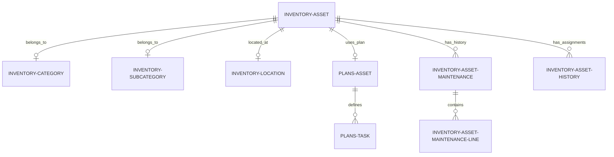
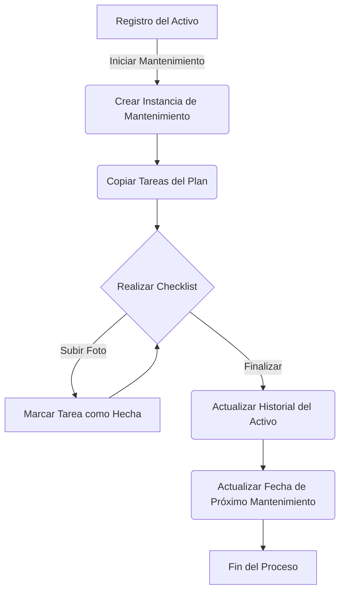

# Módulo de Inventario de Activos - Documentación Técnica (ES)

Bienvenido a la documentación del módulo de Inventario de Activos de Wavext. Esta guía está estructurada según el marco de trabajo Diátaxis para ayudarte a aprender, usar y entender el sistema de manera efectiva.

---

## 1. Tutorial: Primeros Pasos

Este tutorial te guiará a través de la configuración del módulo y la creación de tu primer registro de activo.

### Prerrequisitos
- Entorno **Odoo 18** (recomendado basado en Docker).
- Librería de Python `qrcode` instalada en tu entorno de Odoo.
- Acceso a una base de datos de Odoo con los módulos `hr` y `hr_skills` instalados.

### Paso 1: Instalación del Módulo
1. Coloca la carpeta `Inventario` en el directorio `addons` de tu Odoo.
2. Actualiza la lista de aplicaciones en Odoo (Activar Modo Desarrollador -> Aplicaciones -> Actualizar lista de aplicaciones).
3. Busca "Modulo de inventario de Wavext" y haz clic en **Activar**.

### Paso 2: Configuración Inicial
Antes de crear activos, debes definir la estructura de clasificación:
1. Navega a **Gestión de Activos > Configuración > Categorías**. Crea una categoría (ej. "Hardware", Código: "HW").
2. Ve a **Subcategorías**. Crea una subcategoría vinculada a "Hardware" (ej. "Laptop", Código: "LP").
3. Ve a **Localizaciones**. Crea una localización (ej. "Oficina Principal", Código: "OFF").

### Paso 3: Creando tu Primer Activo
1. Ve a **Gestión de Activos > Operaciones > Inventario**.
2. Haz clic en **Nuevo**.
3. Rellena el **Nombre** (ej. "Laptop de Desarrollador 01").
4. Selecciona la **Categoría**, **Subcategoría** y **Localización** creadas en el Paso 2.
5. Guarda el registro. Verás un **ID Estandarizado** (ej. `HW.LP.OFF.0001.2026`) y un **Código QR** generados automáticamente.

---

## 2. Guías de "Cómo hacer" (How-to Guides)

Recetas prácticas para tareas comunes de desarrolladores y administradores.

### Cómo Asignar un Activo a un Empleado
1. Abre el formulario del Activo.
2. En la sección **Responsable y Propietario**, asegúrate de que el "Tipo de Responsable" sea "Empleado".
3. Selecciona al empleado en el campo **Responsable (Empleado)**.
4. Guarda. El sistema registrará automáticamente esto en la pestaña de **Historial de Asignaciones** y el perfil del empleado ahora mostrará este activo.

### Cómo Iniciar un Proceso de Mantenimiento
1. Asegúrate de que el activo tenga un **Plan de Mantenimiento** asignado en la pestaña de "Detalles Técnicos".
2. Haz clic en el botón **Iniciar Mantenimiento** en la cabecera.
3. El estado cambiará a "En Proceso" y aparecerá una pestaña de "Mantenimiento ACTIVO".
4. Completa las tareas en la lista de verificación (checklist), marcándolas como hechas y opcionalmente subiendo fotos de evidencia.
5. Haz clic en **Finalizar Mantenimiento** para mover el registro al historial y actualizar la fecha del próximo mantenimiento.

### Cómo Imprimir Etiquetas de Activos
1. Abre cualquier registro de Activo.
2. Haz clic en el botón **Imprimir ID** en la cabecera.
3. Se generará un informe PDF que contiene el Nombre del Activo, el ID y el código QR para el etiquetado físico.

### Cómo Extender la Lógica del ID Estandarizado

El ID Estandarizado (`identificador_final`) es un campo calculado almacenado en la base de datos. Actualmente sigue el patrón: `CAT.SUB.LOC.UUID.YEAR`.

Si necesitas modificar esta estructura (por ejemplo, para añadir un código de Departamento):

1.  **Localiza el método**: Busca `_compute_identificador_final` en `models/models.py`.
2.  **Actualiza la Dependencia**: Añade el nuevo campo al decorador `@api.depends` para que Odoo sepa cuándo recalcular el ID.
3.  **Aplica la Lógica**: Actualiza el formateo de la cadena.

**Ejemplo de Implementación:**

```python
@api.depends("categoria_id", "subcategoria_id", "ubicacion_id", "uuid_activo", "anio_inclusion", "dept_id")
def _compute_identificador_final(self):
    for record in self:
        # Obtener códigos o valores por defecto si están vacíos
        cat = record.categoria_id.codigo or "XXX"
        sub = record.subcategoria_id.codigo or "XXX"
        ubi = record.ubicacion_id.codigo or "XXX"
        uid = record.uuid_activo or "0000"
        anio = record.anio_inclusion or "XXXX"
        dept = record.dept_id.code or "DEP" # Componente añadido

        # Combinar en la cadena de ID final
        record.identificador_final = f"{cat}.{sub}.{ubi}.{dept}.{uid}.{anio}"
```

> **Nota**: Dado que este campo tiene `store=True`, los cambios en la lógica solo se aplicarán a registros nuevos o actualizados. Para actualizar registros existentes, es posible que necesites forzar un recálculo a través del Odoo Shell o una acción planificada.

---

## 3. Referencia

Diccionario técnico para desarrolladores.

### Modelos Principales

| Nombre del Modelo | Descripción | Campos Clave |
| :--- | :--- | :--- |
| `inventory.asset` | Registro principal del activo. | `nombre`, `identificador_final`, `qr_code`, `plan_id` |
| `inventory.category` | Agrupación de clasificación. | `nombre`, `codigo` |
| `plans.asset` | Plantilla de mantenimiento. | `periodicidad`, `tarea_ids` |
| `inventory.asset.maintenance` | Instancia de un trabajo de mantenimiento. | `state`, `checklist_line_ids` |
| `hr.employee` | Empleado estándar de Odoo (Extendido). | `current_responsible_asset_ids` |

### Seguridad y Permisos
- **Categoría:** Gestión de Inventario
- **Grupo:** `group_inventory_manager` (Inventory / Full Access).
- **Derechos:** Este grupo tiene permisos CRUD completos en todos los modelos relacionados con el inventario a través de `security/ir.model.access.csv`. `base.user_admin` es miembro por defecto.

### Dependencias
- `base`: Framework central de Odoo.
- `hr`: Gestión de empleados.
- `hr_skills`: Informes de empleados.
- `mail`: Sistema de mensajería y chatter.

---

## 4. Explicación

Entendiendo la arquitectura del sistema.

### Lógica de Trazabilidad de Activos
Cada vez que un activo se asigna a un empleado diferente, el modelo `inventory.asset.history` registra el cambio. Esto se dispara mediante un `@api.onchange` u operación de escritura en el campo `responsable_empleado_id`. Esto asegura una pista de auditoría completa de quién tuvo qué equipo y cuándo.

### Generación de Códigos QR
Los códigos QR se calculan dinámicamente cuando cambia el `identificador_final`. El sistema utiliza la librería de Python `qrcode` para generar una imagen PNG, que luego se codifica en base64 y se almacena en el campo binario `qr_code`. Este código apunta a la URL directa de Odoo del formulario del activo, permitiendo auditorías físicas rápidas.

### Ciclo de Vida del Mantenimiento
El sistema de mantenimiento está desacoplado en **Planes** (plantillas) y **Mantenimientos** (ejecuciones). Cuando comienza un mantenimiento, se crea una nueva instancia que copia las tareas del plan asignado. Esto permite ajustes específicos en una instancia de mantenimiento sin afectar a la plantilla global.

---

## 5. Visuales

### Diagrama de Relación de Entidades (ERD)



### Flujo del Sistema: Proceso de Mantenimiento


